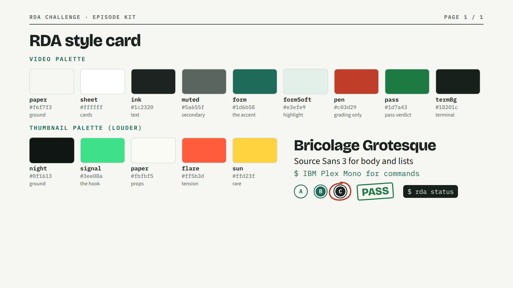

# RDA style bible

**Version 0.1 · 2026-10-05 · a living guide, not a lock.**

This is how RDA videos and thumbnails should look, sound and read, so each episode feels like part of
one series. It is expected to change as the user and the YouTube audience react. When something here
stops working, change it, log why in the [feedback log](#feedback-log), and bump the version. Do not
silently drift: a deliberate change is fine, an accidental one is not.

**Where it lives in code:** `remotion/src/lib/rda.tsx` (the tokens `C`, `T`, `F`, `EASE` and the shared
pieces). Change the code and this file together. The rendered reference is
[`docs/style/rda-style-card.png`](style/rda-style-card.png), made from the live tokens by
`remotion/src/shots/rda-brand/RdaStyleCard.tsx`, so re-render it after any token change.

**Not yet the repo brand contract.** `brand.md`, `remotion/src/brand.ts` and `remotion/src/fonts.ts`
still hold the upstream pipeline's indigo house style. Running `/brand-setup` with this file as input
would make RDA the brand everywhere (see `docs/decisions.md` D8).

---

## 1. The idea in one line

**An exam booklet, graded.** Paper, ruled headers, answer-sheet bubbles, a green that reads as an
official form, and a red pen that only ever marks a grade. Calm and legible like a test paper; the
drama comes from the stakes, not the decoration.

## 2. Color bible

### Video palette (the episode itself)

| Token | Hex | Role | Use it for | Rough share of a frame |
|---|---|---|---|---|
| `paper` | `#f6f7f3` | ground | every full-screen background | most of it |
| `sheet` | `#ffffff` | cards | cards, panels, the score card | large areas |
| `ink` | `#1c2320` | text | headlines, body, filled bubbles | text only |
| `muted` | `#5a655f` | secondary | captions, axis labels, sub-lines | small |
| `rule` | `#d9ded8` | lines | card borders, dividers (decorative only) | hairlines |
| `form` | `#1d6b58` | **the accent** | eyebrows, the active item, arrows, commands, the wordmark | about a tenth |
| `formSoft` | `#e3efe9` | highlight | highlighted ranges, tally bar tracks, chips | small |
| `pen` | `#c03d29` | **grading only** | red-pen circles, underlines on the key word, FAIL | a few marks |
| `pass` | `#1d7a43` | verdict | the PASS stamp only | one moment |
| `termBg` / `termFg` / `termDim` | `#18201c` / `#d7e4dc` / `#8ba096` | terminal | command windows and pills | as needed |
| terminal green | `#5fcf8c` | terminal OK | `[x]`, `OK`, the `next:` line inside terminals | small |

### Thumbnail palette (louder on purpose)

Thumbnails compete at 320 pixels wide in a feed, so they flip to a dark ground and a saturated accent.

| Token | Hex | Role |
|---|---|---|
| `night` | `#0f1613` | ground (a green-black, not pure black) |
| `signal` | `#3ee08a` | the hook: the one thing that must be seen |
| `paper` | `#fbfbf5` | props: answer sheets, cards |
| `flare` | `#ff5b3d` | tension: a question mark, a warning, one word |
| `sun` | `#ffd23f` | rare: a number or badge when signal is already used |

### Measured contrast (WCAG ratio; 4.5 is the text minimum, 3 for large text)

| Pair | Ratio | Verdict |
|---|---|---|
| ink on paper | 14.9 | any text |
| ink on formSoft | 13.6 | any text |
| termFg on termBg | 12.7 | any text |
| form on sheet / on paper | 6.4 / 5.9 | text, including small |
| muted on paper | 5.6 | secondary text |
| pass on sheet | 5.4 | text |
| form on formSoft | 5.4 | text |
| pen on paper | 4.95 | text, just; best as marks |
| rule on paper | 1.27 | **never text**, lines only |
| thumbnail: paper on night | 17.7 | anything |
| thumbnail: sun on night | 12.7 | anything |
| thumbnail: signal on night | 10.7 | the hook |
| thumbnail: flare on night | 6.0 | text |
| thumbnail: flare on paper | 2.97 | **avoid**; marks on paper use `pen` |
| thumbnail: signal on paper | 1.65 | **never** |

### Color rules

1. **One accent per frame.** `form` in video, `signal` in thumbnails. If two things are accented,
   neither is.
2. **Red means a grade.** `pen` (and `flare` in thumbnails) is for marks, FAIL, and tension, never decoration.
3. **Never color alone for pass and fail.** Always say the word (PASS, FAIL) or show a symbol. About
   one man in twelve cannot reliably tell this red from this green.
4. **`form` and `pass` are close greens.** Keep `pass` for the verdict stamp so it keeps its meaning;
   everything else that is green is `form`. If the audience confuses them, separate them (log it).
5. **Sample or illustrative data is labeled** on screen, in `muted` mono caps, above the card it belongs to.

## 3. Typography

| Role | Family (kit name) | Weight | Typical size at 1080p | Notes |
|---|---|---|---|---|
| Headline | Bricolage Grotesque (`F.display`) | 800 | 76 to 104 px, hero 128+ | tracking -0.02em, tight leading 1.05 |
| Eyebrow / label | IBM Plex Mono (`F.mono`) | 600 | 22 to 26 px | ALL CAPS, tracking 0.14em, in `form` |
| Body / list | Source Sans 3 (`F.body`) | 400 to 600 | 38 to 58 px | the reading voice |
| Commands, files, hashes | IBM Plex Mono | 400 to 600 | 26 to 34 px | anything you could type |
| Thumbnail hook | Bricolage Grotesque | 800 | 200+ px at 1280x720 | one or two words |

Fonts are local files in `media/library/fonts/rda/` (OFL), loaded by the kit. On-screen text must be
readable without narration: hold each line at least as long as it takes to read twice.

## 4. Layout

- **Margins:** 110 px left and right at 1920x1080. Content starts below the header strip.
- **The header strip** (`PaperChrome`): `RDA CHALLENGE · EPISODE KIT` left, `PAGE n / N` right, ruled
  in `ink`. The page number is real (the scene index), not decoration.
- **Hierarchy:** eyebrow, headline, then the one visual. Three levels at most.
- **Cards** get a 2 px `rule` border and a 12 to 14 px radius; one card per idea.
- **Talking-head episodes:** concept beats are full-screen cutaways; overlays stay in the top or bottom
  band and never cover the face (pipeline rule from `/make-tsx`).

## 5. Motifs (the series vocabulary)

| Motif | Means | Kit piece |
|---|---|---|
| Answer bubble, filling | a rule, a step, a choice made | `Bubble` |
| Red-pen circle or underline | the key word, the graded answer | SVG path, `pen` |
| Grading stamp | a verdict: PASS, FAIL, FROZEN | `Stamp` |
| Terminal window or pill | the tool doing something real | `Terminal` |
| Hash text, typed out | proof that the exam is frozen | mono, `form` |
| Five-phase bar, to scale | the format itself | from the explainer's S2 |

Use the same motif for the same meaning every time. New motifs get added here before they are reused.

## 6. Motion

- **Entrances:** fade and rise, about 14 frames at 30 fps, 24 px of travel, ease-out (`EASE.out`).
- **Stagger:** 12 to 30 frames between lines that should be read one at a time.
- **Stamps** land in about 9 frames, from 1.6x scale and a slight extra tilt to rest at about -4 degrees.
- **Typing** for commands, at a readable pace (about 2 frames per character).
- **Scene cuts:** an 8-frame fade at each end of a scene. No spins, no elastic bounces.

## 7. Sound

| Moment | Cue (from `media/library/sfx`) | Level (0 to 1) |
|---|---|---|
| A mark, a tick, a checklist line | `ui-click-soft` | 0.2 to 0.4 |
| A card or file appears | `pop-reveal` | 0.24 to 0.3 |
| A verdict stamp | `stamp-hit` | about 0.55 |
| PASS | `chime-reward` right after the stamp | about 0.4 |
| A handoff or scene sweep | `whoosh-soft` | about 0.45 |
| The closing line | `impact-soft` | about 0.4 |

- **Music bed:** `docu-pluck` for explainers (curious, light). At about 0.8 with no voice; drop it well
  under the voice in talking-head episodes (the pipeline's `mix_music.py` default is -7 dB).
- **Loudness:** every export ends at -16 LUFS integrated, -1.5 dBTP, via `tools/master_audio.py`.
- One stamp per verdict. Do not stack risers.

## 8. Thumbnails

**Every video ships with a thumbnail.** No exceptions: episodes, explainers, shorts that get one. A video
is not finished until its thumbnail is made, checked at 320 px, and saved in `videos/<project>/packaging/`.
`rda status` enforces this for episodes.

1. Dark `night` ground, one `signal` hook, props in `paper`. Nothing else competes.
2. **One hook**, one or two words or one number, that **does not repeat the title**.
3. Two or three levels of focus at most: hook, hero object, then (optionally) the host's face.
4. Keep the bottom-right corner clear for YouTube's timestamp.
5. **Honesty:** never show a score, a result, or a prop the video does not deliver.
6. **Check at 320 px wide** before shipping. If the hook does not read there, it is not done.
7. When the face kit and a Gemini key exist, the `/thumbnail` skill can add the host; keep this palette.

Reference: `videos/rda-explainer/packaging/thumb-A.jpg`.

## 9. Words on screen

- **No em dashes or en dashes.** Anywhere. Use a period, a colon or a comma.
- Short sentences. Exact numbers only; nothing estimated is shown as measured.
- Commands and file names exactly as typed, in mono.
- First-timer framing in debriefs on health, legal or safety topics (viewer contract rule 6).

## 10. What to test with the audience

Open questions this guide does not settle yet. Answer them with feedback and retention data, then log it.

- Is the light paper look too quiet next to louder channels, or does it stand out by being calm?
- Does a dark variant of the video palette work better for the debrief (B4) stretch?
- Does `signal` green read as "pass" so strongly that a FAIL episode needs a different thumbnail accent?
- Does a face in the thumbnail beat the graphic-only look for this series?

## Feedback log

Add a row whenever the user, comments, or data change the style. Newest first.

| Date | Source | Observation | Change | Version |
|---|---|---|---|---|
| 2026-10-05 | user | Every video must ship with a thumbnail | made a rule in section 8, CLAUDE.md and `rda status` | 0.1 |
| 2026-10-05 | session | First version, distilled from the RDA Episode Kit page, the explainer and thumbnail A | created | 0.1 |

## Changelog

- **0.1 (2026-10-05):** first version. Video and thumbnail palettes with measured contrast, type, layout,
  motifs, motion, sound, thumbnail and copy rules. Kit moved to `remotion/src/lib/rda.tsx` so every
  video shares one source.
